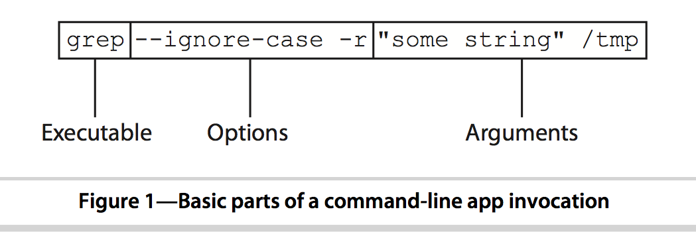
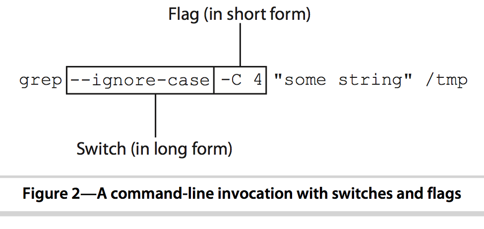
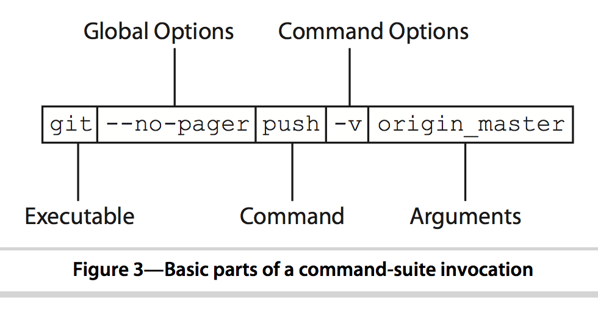

Portland Code School
--------
#Command Line interfaces

## Command line conventions

Command line scripts have a user interface with patterns and conventions, just like graphical user interfaces.

Take a moment and [read this excerpt](http://media.pragprog.com/titles/dccar2/understand.pdf) from the excellent book, [Build Awesome Command-Line Applications in Ruby 2: Control Your Computer, Simplify Your Life](http://pragprog.com/book/dccar2/build-awesome-command-line-applications-in-ruby-2)

Briefly, here's the anatomy of a command line user interface.

There are two things you feed to a program, *options* and *arguments*. The arguments are often *what* that the program operates upon, the options are *how*.

There are two types of options, *long* (two dashes followed by whole words) and *short* (one dash followed by one letter). Most often, the application should take both forms for any given option. If the option takes a value, it's called a "flag", otherwise it's a *switch*.

Some programs take a *command*.

When this happens, sometimes the program takes *global* options AND the command takes *command* options. Only the command takes arguments.

## Command line libraries for Ruby scripts

There are a lot of command line libraries to choose from. See [this list of command line gems](http://www.awesomecommandlineapps.com/gems.html).

The Ruby Standard Library includes a class called [OptionParser](http://ruby-doc.org/stdlib-2.1.0/libdoc/optparse/rdoc/OptionParser.html). This is built in to Ruby so it is the most common solution. It can get complicated, though.

The Thor gem is used by several other very important gems and utilities (like Rails, Bundler, etc.). It's worth getting to know thor to help you understand how these other things work. Thor is much more than a command line library, but the command line aspect of it is pretty easy to use.

There are a couple of command line app frameworks, like [Methadone](https://github.com/davetron5000/methadone), that provide lots of additional functionality and are extremely easy to use, but (and this is the point of frameworks) they hide basic operations behind high-level convenience methods.

## Using thor

The command line part of thor is dead simple to use.

* Your *program* is represented by one *class*
* Each *command* is implmented with one *method* with a little DSL sugar for help info
* The *arguments* to the command are simply the arguments to the method
* *options* are defined with a simple DSL and delivered in an options hash.
* Help and usage information are generated automatically 

Start with the [thor web site](http://whatisthor.com) and take a look at a simple [demo program](https://github.com/Auraelius/thordemo) that we will cover in class.

## References

An excellent book on this topic is [Build Awesome Command-Line Applications in Ruby 2: Control Your Computer, Simplify Your Life](http://pragprog.com/book/dccar2/build-awesome-command-line-applications-in-ruby-2). We've referenced several excerpts already. You don't need to buy it for this class, but in time you will want to own a copy.

[Treehouse video series on the command line](http://teamtreehouse.com/library/console-foundations-2)

[Thor Introduction](http://whatisthor.com) 

Copyright © 2014 Alan Zimmerman

Used by permission by Portland Code School