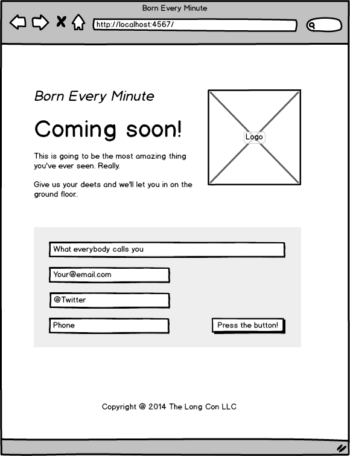
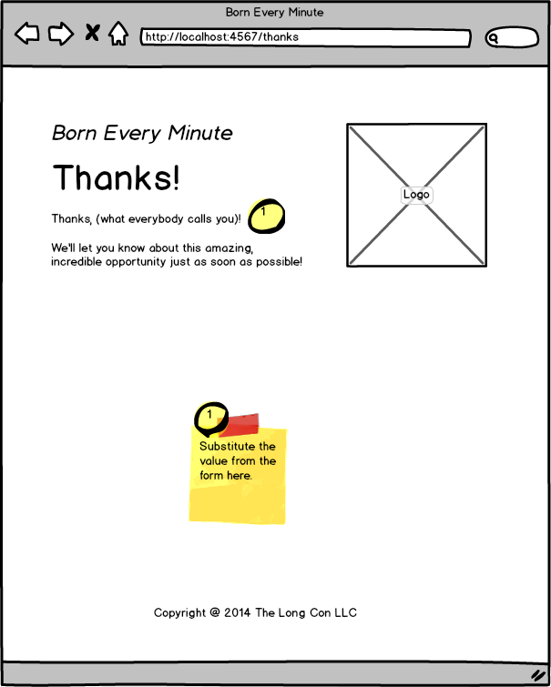
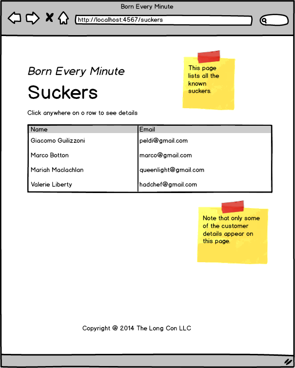
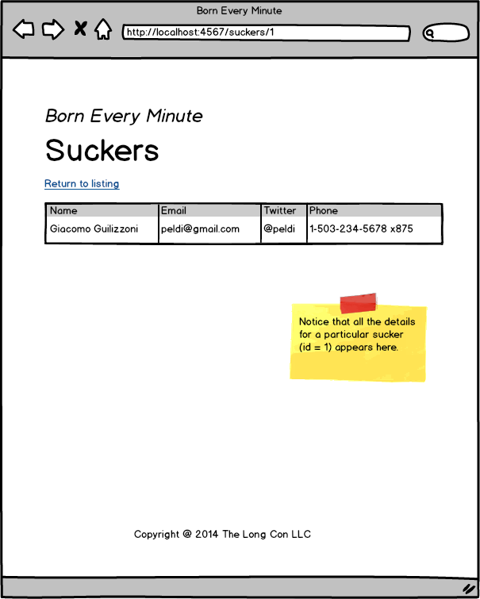
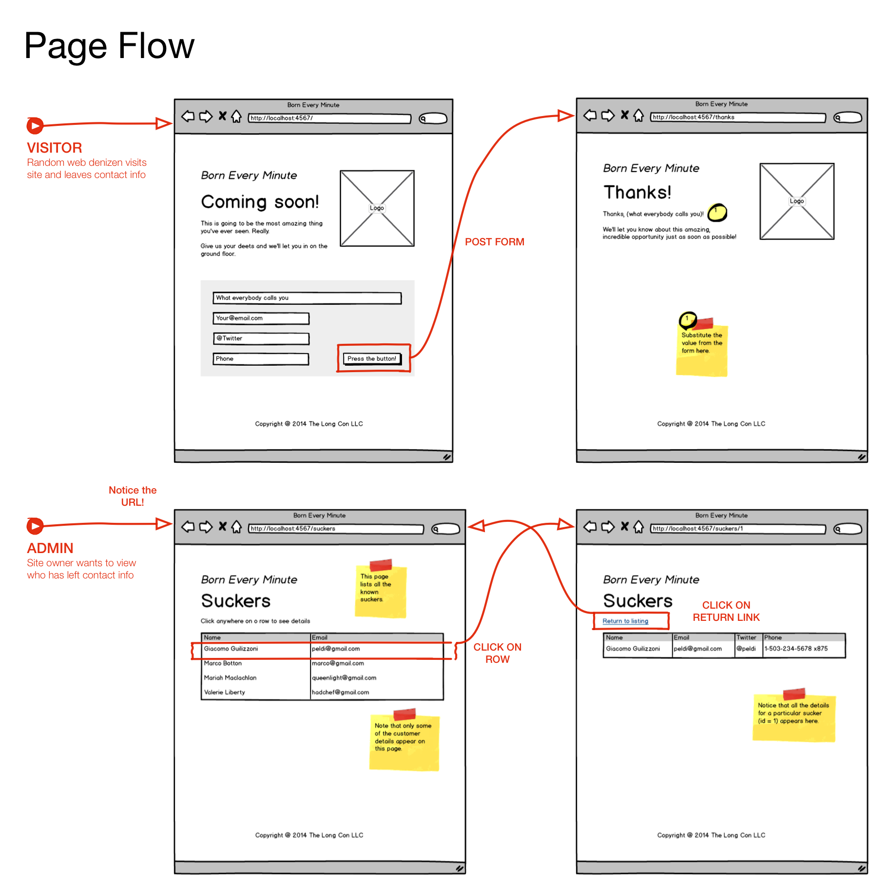

*Portland Code School*

Web Development with Ruby on Rails

#Code Challenge 06

#DO NOT START THIS CODE CHALLENGE. IT'S GOOD TO READ THROUGH IT, BUT DON'T START CODING UNTIL YOU HEAR FROM YOUR INSTRUCTOR.

## Overview

This code challenge has you build our first web application, using a gem called, "sinatra".

You are on a design team with your PCS partner, your PCS instructor (as customer advocate), an imaginary front-end designer named Frank "Front-End" Stein and a equally imaginary technical lead, Emily "Engineering" Smith.

Your specification for this code challenge takes the form of several emails from your project team. Read through them carefully and try and understand what you need to build.

Build your project in several iterations, as described by Emily. The first few iterations are guided and simple and are part of this code challenge. The later iterations, in subsequent code challenges, require more digging on your part. For each iteration, commit and *tag* your files for later. As before, you may be called upon to revert your repository and demonstrate your code and tests for an earlier iteration. 

Everybody should do be able to get through all of the iterations. See below for how to adapt the challenge requirements to your skill level. Get as far as you can. *Do not get stuck*. I've noticed teams in previous code challenges spending time pondering and wondering. Sometimes they get stuck, sometimes they create far too much code. This time, if you have a question, give it your best shot, do your homework, and, if you are still stuck, ask me or another team. Even if you are relatively inexperienced, you should be able to do *something* in each iteration.

**Note: Whatever code you write must adhere to [this style guide](https://github.com/bbatsov/ruby-style-guide) so use [the checker that goes with it](https://github.com/bbatsov/rubocop) as you code.  You must check your code as part of your commit process and either fix all problems or clear your exceptions with me before proceeding. You will have to document your exceptions in your code as comments.**

## Deadline

As before, consult with your partner and give your instructor an estimate of when you think you might finish. Then the instructor will tell you the class deadline.

## Difficulty levels

I want you to to adjust the difficulty of the assignment to match your pair's current skill level. I want everybody to set themselves the goal of completing all iterations. However, I want you to adjust how you complete the iterations to match your abilities.

#### Easy

If you feel you are operating at the "easy" level, do just what is necessary to achieve the functionality for each iteration.  You do not necessarily have to achieve the look and feel that the client requested, and you may not be able to achieve good code coverage or adhere to the principles of "test-driven design". If you can't get all the functionality for a particular iteration, check in with your "customer advocate" (me). You may be able to get a waiver and move to the next iteration.

#### Medium

If you are operating at the "medium" level, you must complete all of the functionality requirements, you must achieve the exact look and feel requested by the client, and you should do your best to adhere to the principles of "test-driven design". If you cannot figure out how to write the test for a particular function, again, check in with your "customer advocate" (me). You may be able to get a waiver and revert to "code-first" methods. Some things may not be testable, at least with MiniTest.

#### Hard

If you are operating at the "hard" level, you must be complete on functionality and look & feel.  You must adhere to TDD principles.  

# What, this is a spec?

## Iteration 1

--------
**To: Design Team**

**From: Emily**

**Subject: Getting started on the "Born Every Minute" account**

People,

While Frank is working with the client to nail down the look and feel, wireframes, and page flow, I think we can get started with the Sinatra framework. Here's what I'd like to see for iteration one:

0. Get Sinatra installed on your systems, review the materials on HTTP and other topics that you've got, and, in general get your development environment synchronized with your pair programming partner.

0. Create a repository in your personal git hub account and have both you and your partner use it during development. We'll fork the repo later into the company account.

0. Use the sample app files in the code challenge repo. Copy the sample sinatra app folder tree to your repo (and make sure you don't bring any of the git dot files.) 

0. Make the sample app passes its first tests. **Notice that we are using MiniTest on this project!** You will have to fill in the code, these are just some routes. As you can see, we will be using the "classic" form of Sinatra, not the "modular" form. Let's keep things simple.

0. Don't worry about stylesheets yet, we will deal with those later.

Hopefully, by the time you've got that up and running, Frank will be back with the details on what the client wants.

I'm excited to get this project started!

Emms

### Iteration 2

--------
**To: Design Team**

**From: Frank**

**Subject: Finally, the client has made some decisions.**

I mean, honestly! Some people never make up their minds!

Here are the wireframes and page flow diagram for the "born every minute" account. I know there isn't enough information here to finish, but just getting this far was like pulling teeth! Chicken teeth! And I know you guys of been waiting, so here it is.

First, what we don't know. Just help me out and fill in these details until I get you more information.

0. The client hasn't decided on a logo. However, it it's important that we put some sort of image on the pages. Please find an image somewhere (and watch those licenses, please!). If you can make it work on the concept of "trustworthiness" and "excitement", that would be even better. These are the clients keywords. You'll notice that the logo has to appear on every page visible to the customer.

0. The client hasn't finalized the color palette yet, so please just give us some styles that match the following criteria:

    0. Warm cream colored background. No whites, please!
    0. No black fonts! Give me a charcoal but make it readable.
    0. Pick a sans serif font. I'll get you the exact web fonts and font stack sometime. Hopefully.
    0. You'll notice that the form has a background color. We need a shade of green that reinforces the "trustworthiness" concept but keep it light, people! And no rounded corners! That is so 2010. Keep it flat, but if you want to drop shadow, I guess I can live with that.

Okay, here's the wireframes. Be sure to check out the URLs in the title bar.

Visitors arrive at this page:

When they fill out the form and click submit, they end up at the "Thanks!" page, below.   Notice that we use the form data to craft our welcoming and reinforcing message to the sucker, I mean customer. (That's what comes from spending too much time with the client.)

The client wants an admin interface. Don't worry about authentication at this point, just create the unique URL as shown in the wireframe. When they hit this URL, they want a list of everybody who has responded to the form along with jus their email:

When they click on one of the respondents, anywhere in the row of the table, they want to go to a page that shows all the details for that particular customer. That page has a link to return to the base of the admin pages. The detail page looks like this:

Finally, here's a page flow diagram that summarizes what I've got so far.

I'll get you more information as soon as I know it. Clients: can't live with them, can't shoot them.

Ciao Bella!

Frankie

--------
**To: Design Team**

**From: Emily**

**Subject: Setting up a project structure and getting started.**

Okay, I'm assuming you've heard from Frank by now. In iteration 2, I'd like us to achieve the next set of functionality:

0.Use a folder structure that uses the built-in Sinatra assumptions. Check the readme webpage. Don't forget a public assets folder, a views folder, and a tests folder.

0. Make sure to include a public assets folder for the stylesheet. Keep the stylesheet simple, but see what we can do about producing what Frank is able to tell us. Each of you can pick a different logo file, just name it the same.

0. Set up a standard layout that includes the header and footer that appears on every page. Use partials for the stuff that's repeated from page to page.

0. Use external view template files in their own folder and the ERB templating language.

0. All code needs to pass the Rubocop style checker. I don't want any more arguments about spaces at team meetings. All exceptions have to be cleared through me or the customer advocate.

0. Don't worry about storing the form data in any persistent manner yet. Every time they submit a form, you can just use variables to display the name on the "thanks" page. We're still working on our database back end strategy. For now, just make sure that the form data is used in the "thanks" page as Frank describes. 

0. You can use dummy data for the admin pages. Don't worry about using form data. (You'd have to store the form data in the session cookies or something fancy like that and it's not necessary.)

0. In the admin page, your table can include just one row, but implement the link to the details page right away. When the user clicks on a row of the listing, show the details for that row on a separate page. For now, just carry the details in variables.

0. On the details page, display all the data for a particular person. Be sure you use REST URLs. 

That's it for this iteration. Let me know if there's any problems.  Be sure to talk to the team if you get stuck and talk to the customer advocate if you're just having any problems with one of the features.

I'm glad this is underway.

Next, we'll have a data persistence strategy for you. I hear they are going to hire an expert.

Emms

Copyright © 2014 Alan Zimmerman  
Used by permission by Portland Code School