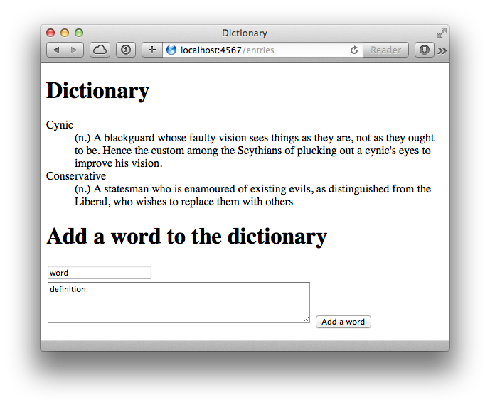
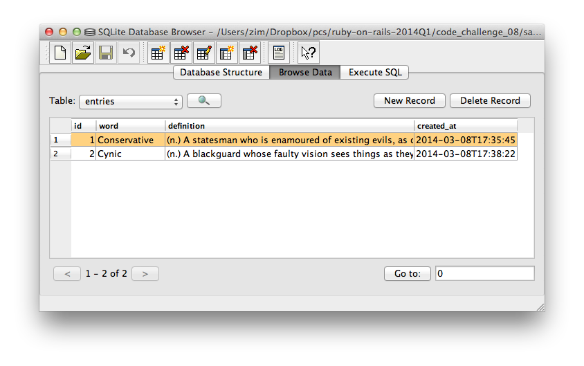
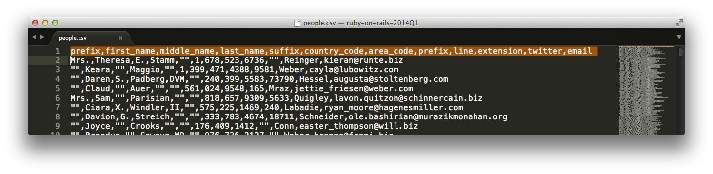
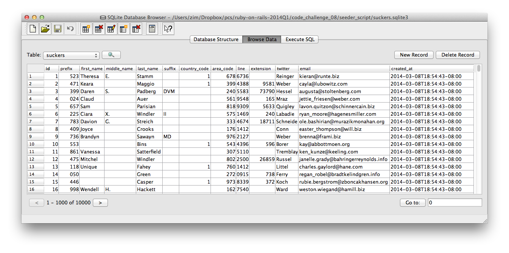

*Portland Code School*

Web Development with Ruby on Rails

#Example DataMapper Applications

## DataMapper in Sinatra Apps

The basic sequence for using DataMapper is laid out in your code:

0. Connect up to a database
1. Define your model (your objects)
2. Tell DataMapper to create the database schema from your model
2. Use DataMapper methods to store, find, and retrieve your objects.

Read the comments, then we'll see the app in action.

````ruby
require 'sinatra'
require 'data_mapper' # metagem, requires common plugins too.

# need install dm-sqlite-adapter
DataMapper.setup(:default, "sqlite3://#{settings.root}/dictionary.sqlite3")


# You don't have to define the instance variables, DataMapper does that using
# the "property" method
class Entry
  include DataMapper::Resource
  property :id, Serial
  property :word, String
  property :definition, Text
  property :created_at, DateTime
end

# Perform basic sanity checks and initialize all relationships
# Call this when you've defined all your models
DataMapper.finalize

# automatically create the entries table
Entry.auto_upgrade!

# Makes it easy for visitors to learn where things are on your site
get '/' do
  redirect 'entries'
end

# Create a new dictionary entry. Note how easy it is given the 
# choice of variable names in the form.
post '/entries' do
  e = Entry.new(params[:entry])
  e.save
  redirect 'entries'
end

get '/entries' do
  # get the latest 20 entries
  # The parameters sent to the "all" method are similar to SQL 
  # These particular ones say, "return 20 by descending order of ID"
  @entries = Entry.all(:order => [ :id.desc ], :limit => 20)
  erb :entries
end

__END__
@@entries
<!DOCTYPE HTML>
<html>
  <head> 
    <title>Dictionary</title>
  </head>
  <body>
    <h1>Dictionary</h1>
    <dl>
      <% @entries.each do |e| %>
        <dt><%= e.word %></dt>
        <dd><%= e.definition %></dd>    
      <% end %>
    </dl>
    <h1>Add a word to the dictionary</h1>

    <!-- NOTICE the naming convention in the form -->
    <form method="post" action="/entries">
      <input type="text" name="entry[word]" value="word"> <br />
      <textarea rows="4" cols="50" name="entry[definition]" value="definition">definition</textarea>
      <input type="submit" value="Add a word">
    </form>
  </body>
</html>
````

When you first start the Sinatra app, it sets up the database. 

The POST route handler takes the _params_ hash and hands the _entry_ hash it contains directly to your model. The _new_ method creates a new object and the _save_ method stores the object in the database.

The GET route handler pulls out all of the entries from the database that match the given criteria, loads them into an instance variable, and hands that variable to the view.

After a couple of form submittals, the browser displays the previous entries and the form:



(The dictionary entries are from Ambrose Bierce's _The Devil's Dictionary_.)

Fire up the SQLite client, open the database file, and you can see the database contents. Notice how DataMapper names the table as the plural of the class name (a common convention) and automatically maintains the _created_at_ timestamp.



Try it yourself!

# DataMapper in scripts

You can use DataMapper in any ruby script, not just web applications. One common task is seeding databases with data from some legacy system. Let's say we have a CSV file from someplace:



Notice the header row. We make sure that the column names don't have spaces in them. That way they don't need to be quoted when we play with them later.

Now, here's a simple little script to input this data into a database. Check out a few things:

* All the DataMapper stuff is the same as the previous example
* The properties in the model are exactly the same as the column names. We copied and pasted them to make sure.
* The actual import is only four lines. This is possible because of the way we use the CSV library, the care we took in naming properties to match the CSV file, and the natural brevity of Ruby. Here they are:

````ruby
suckers = CSV.foreach('people.csv', headers:true) do |row|
  s = Sucker.new(row)
  s.save
end
````

The rest of the script just provides a convenient progress indicator. If an operation takes more than a few seconds, you should give the user an indication of what's happening.

Here's the whole script:

````ruby
require 'data_mapper' 

# progress indicator stuff
cr = "\r"           
clear = "\e[0K"     
reset = cr + clear
record_count = 1

# DataMapper stuff
DataMapper.setup(:default, "sqlite3://#{Dir.pwd}/suckers.sqlite3")

# these properties exactly match the column headers in the CSV file
class Sucker
  include DataMapper::Resource
  property :id, Serial
  property :prefix, String
  property :first_name, String
  property :middle_name, String
  property :last_name, String
  property :suffix, String
  property :country_code, String
  property :area_code, String
  property :prefix, String
  property :line, String
  property :extension, String
  property :twitter, String
  property :email, String
  property :created_at, DateTime
end

DataMapper.finalize
Sucker.auto_upgrade!

# for each row in the file, make an object and store it in the database.
suckers = CSV.foreach('people.csv', headers:true) do |row|
  s = Sucker.new(row) # this is all it takes because we use the headers.
  s.save

  # indicate progress
  print "#{reset}records: #{record_count}"
  $stdout.flush
  record_count +=1
end
````

After this script runs, the 10,000 lines of the files have become 10,000 records in a database:



Notice that the order of the attributes in the table is not the same as the CSV fields. In fact, like hashes, there is no guaranteed order for attributes. You can't depend on index numbers. You have to refer to the data by name.

You'll use both of these techniques in the next code challenge.


<hr />
Copyright © 2014 Alan Zimmerman <br />
Used by permission by Portland Code School